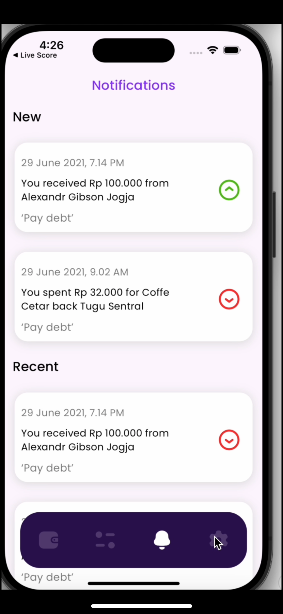
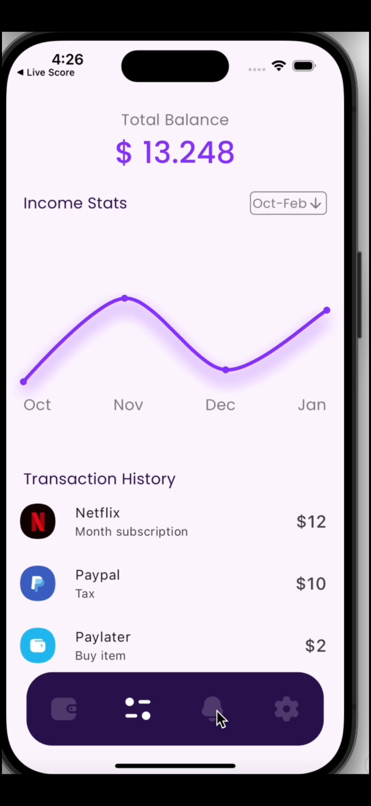
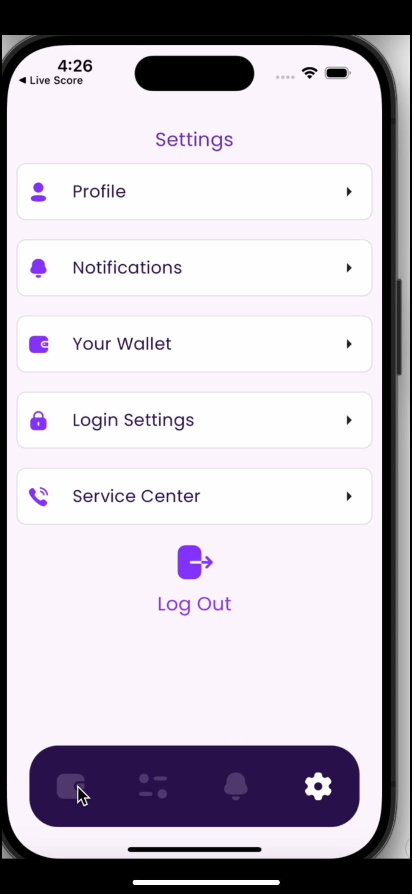
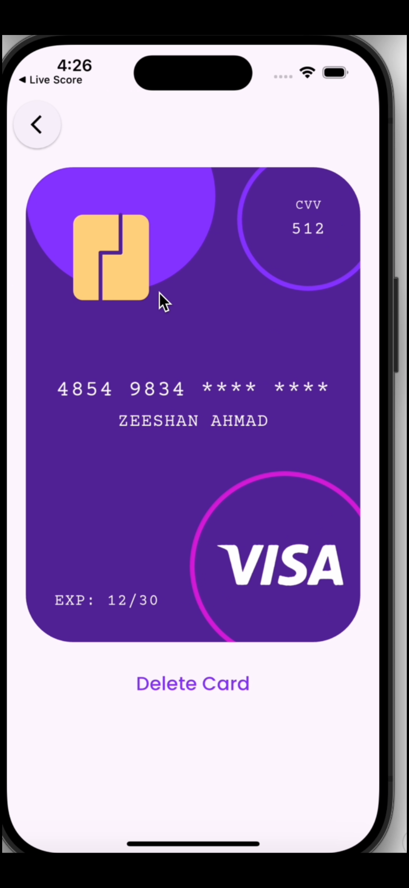

# Wallet UI App - Flutter

This Flutter application features a sleek and intuitive wallet user interface designed to manage financial transactions and status.

## Installation

1. Clone the repository:

```bash
git clone https://github.com/zeeshan941983/walletApp-Ui.git
```
2. Navigate into the project directory:

```bash
cd walletApp-Ui
```
3. Install dependencies::

```bash
flutter pub get
```
4. Install dependencies::

```bash
flutter run
```

# Screens

### Card Screen
The card screen displays a stylish 3D representation of a credit card that can be flipped to reveal additional details such as CVV and expiration date.

### Settings Screen
The settings screen offers options for managing user preferences and account settings, including profile management, notifications, and security settings.

### Status Screen
The status screen provides an overview of the user's financial status, including total balance and income statistics over selected periods represented using interactive charts.





## Features

- Interactive Card Interface: Utilizes animations for a realistic card flipping experience.
- Comprehensive Settings: Allows users to customize their profile,manage notifications, and adjust security settings.
- Financial Insights: Presents users with graphical representations of income and expense trends over time.

## Dependencies

- Flutter SDK: Version 2.0.0 or higher
- Google Fonts: For customizable typography
- FL Chart: For creating interactive and visually appealing charts
- Iconly: For a set of customizable icons

## Contributing

Pull requests are welcome. For major changes, please open an issue first
to discuss what you would like to change.

Please make sure to update tests as appropriate.
## License

[MIT](https://choosealicense.com/licenses/mit/)
